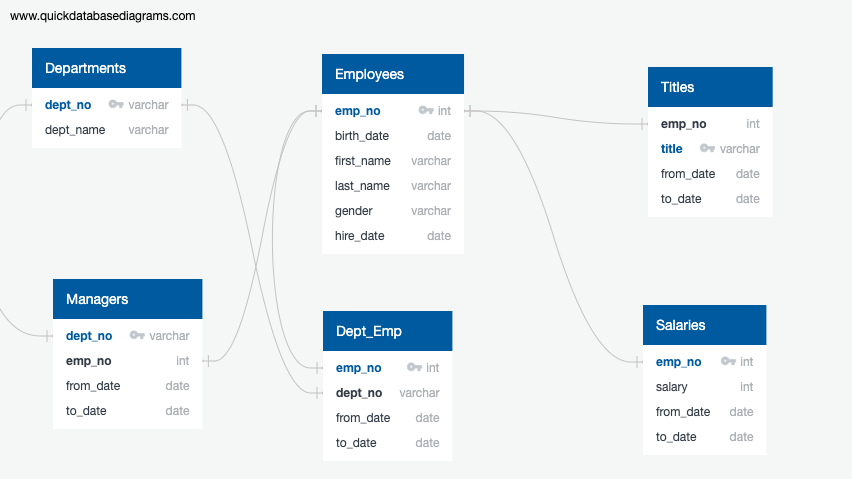

# Pewlett-Hackard-Analysis

There are a total of 1465 employees who are born between January 1, 1965 and December 31, 1965 who can potentially become mentors for younger employees.

NOTE:
Please find queries inside queries folder
Please find resulting csv inside data folder
